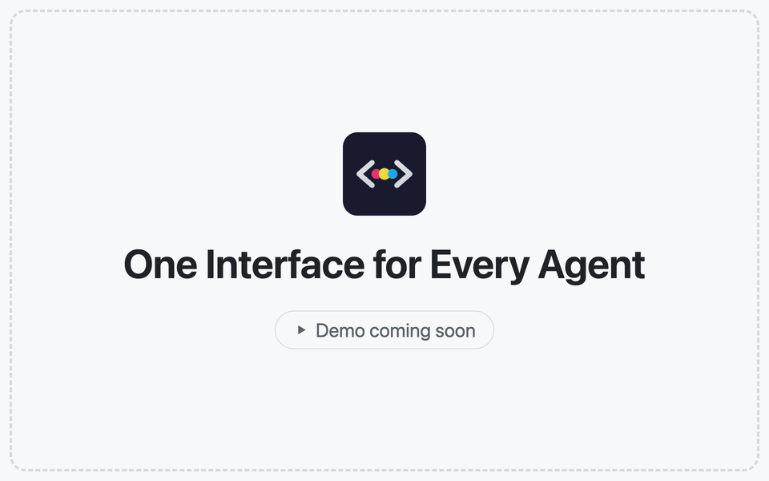
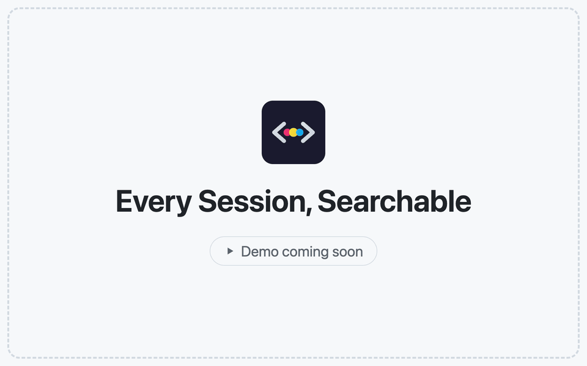
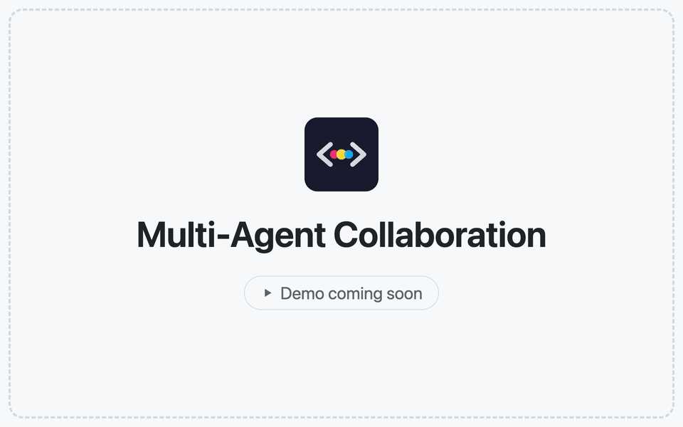
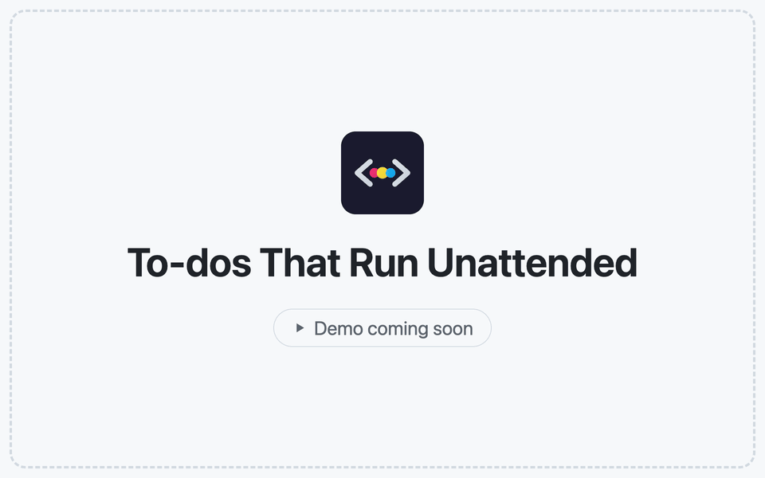
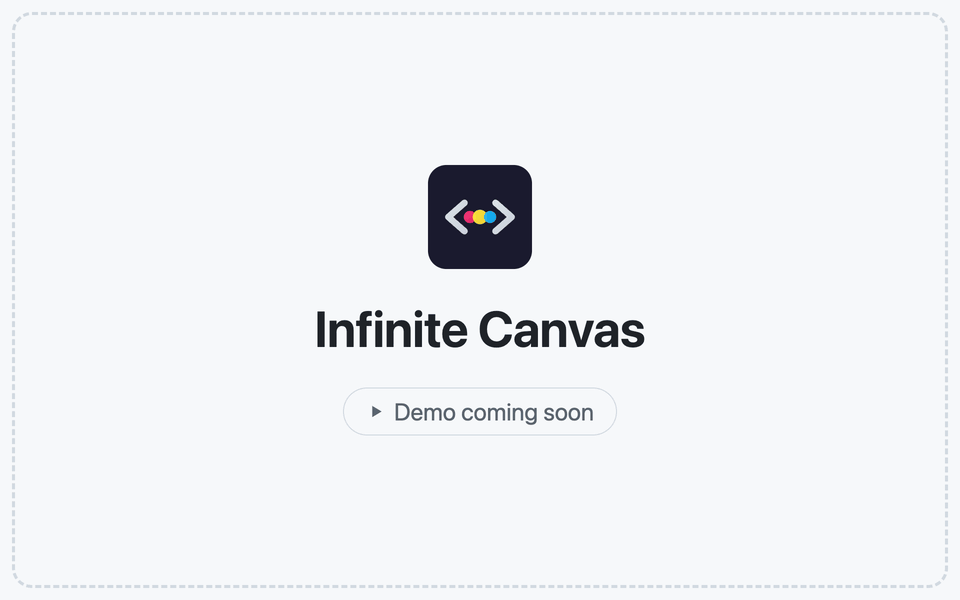
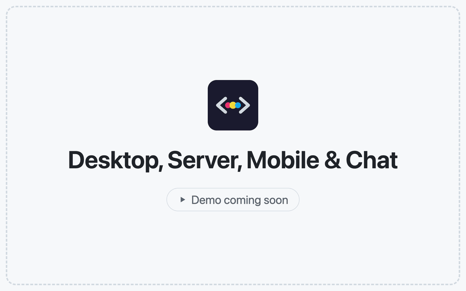
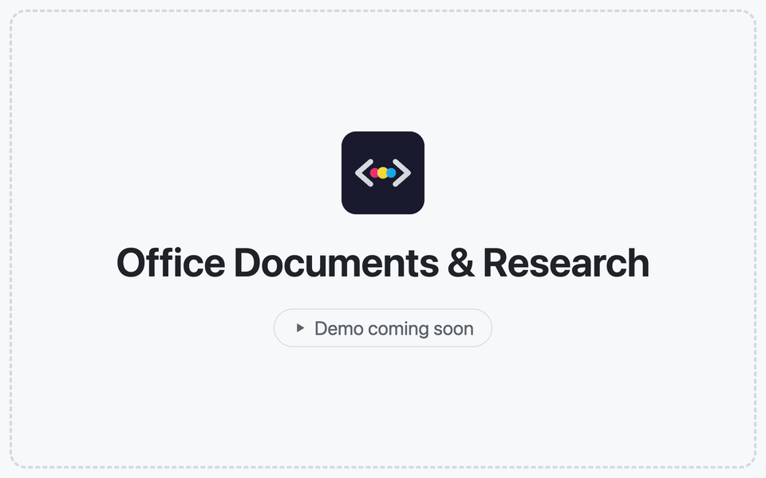
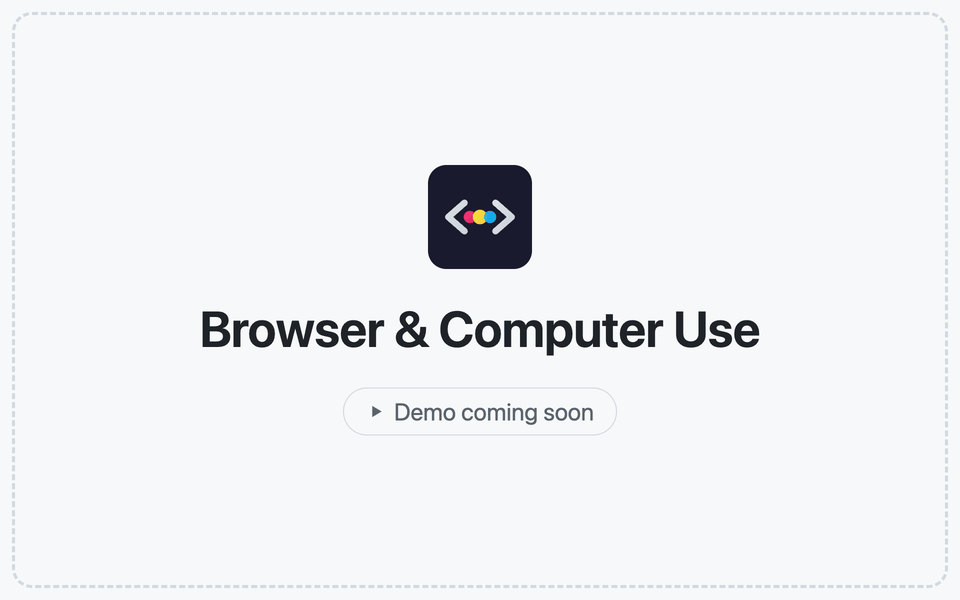
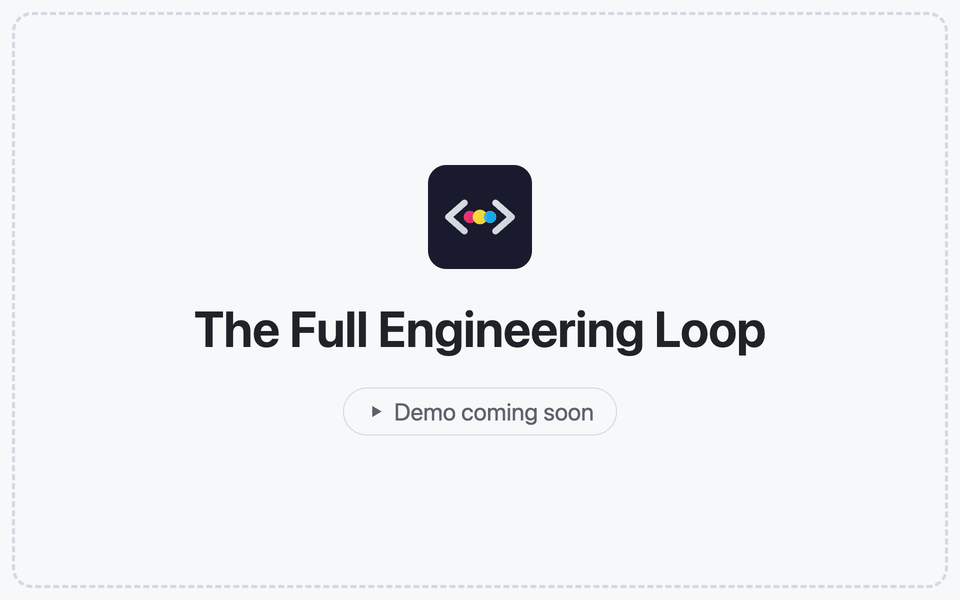

<h1 align="center">
  <a href="https://docs.codeg.app"></a> Codeg
</h1>

<p align="center">
  <a href="https://github.com/spacering-net/codeg"></a>
  <a href="https://github.com/spacering-net/codeg/releases/latest"></a>
  <a href="https://github.com/spacering-net/codeg/releases"></a>
  <a href="../../LICENSE"></a>
  <a href="https://docs.codeg.app"></a>
  <a href="https://docs.codeg.app/getting-started/installation"></a>
</p>

<p align="center">
  <sub><a href="../../README.md">English</a> · <a href="./README.zh-CN.md">简体中文</a> · <a href="./README.zh-TW.md">繁體中文</a> · <a href="./README.ja.md">日本語</a> · <a href="./README.ko.md">한국어</a> · <strong>Español</strong> · <a href="./README.de.md">Deutsch</a> · <a href="./README.fr.md">Français</a> · <a href="./README.pt.md">Português</a> · <a href="./README.ar.md">العربية</a></sub>
</p>

<p align="center">
  <strong>El espacio de trabajo de programación multiagente.</strong><br/>
  Ejecuta todos los agentes de programación con IA en un mismo lugar y deja que trabajen juntos.
</p>

<h3 align="center"><a href="https://github.com/spacering-net/codeg/releases/latest"><ins>Descargar Codeg</ins></a> · <a href="https://docs.codeg.app"><ins>Documentación</ins></a></h3>

<p align="center">
  <picture>
    <source media="(prefers-color-scheme: dark)" srcset="../images/workspace-dark.png" />
    
  </picture>
</p>

<table>
  <tr>
    <td width="50%" valign="top">🧩 <strong>Una interfaz para todos los agentes</strong><br/>Quince agentes integrados, y cualquier agente compatible con ACP puede sumarse: todos se presentan como la misma conversación estructurada, no como una terminal.</td>
    <td width="50%" valign="top">🔎 <strong>Sesiones que viajan</strong><br/>Importa, busca y retoma el historial que cada agente guarda en disco, y luego pásaselo a otro agente.</td>
  </tr>
  <tr>
    <td width="50%" valign="top">🤝 <strong>Agentes que trabajan juntos</strong><br/>Delega en otros agentes con una <code>@</code> o pon en cola tareas pendientes que se ejecutan sin supervisión en sus propios worktrees.</td>
    <td width="50%" valign="top">🌍 <strong>Allí donde trabajes</strong><br/>App de escritorio, servidor autoalojado o Docker, iPhone, iPad y Android, además de Telegram, Lark o WeChat.</td>
  </tr>
</table>

## 💖 Patrocinadores

<table>
  <tr>
    <td align="center" width="220">
      <a href="https://www.compshare.cn/?ytag=GPU_YY_git_codeg" target="_blank"></a><br/>
      <strong><a href="https://www.compshare.cn/?ytag=GPU_YY_git_codeg">Compshare (UCloud)</a></strong>
    </td>
    <td>¡Gracias a Compshare por patrocinar este proyecto! Compshare es la plataforma de IA en la nube de UCloud, que ofrece planes Plan de agentes con modelos nacionales en suscripción mensual o por uso, desde 49 ¥/mes. También proporciona acceso estable a modelos extranjeros mediante proxy oficial. Compatible con Claude Code, Codex y llamadas a la API. Apto para empresas: alta concurrencia, soporte técnico 24/7 y facturación en autoservicio. ¡Los usuarios que se registren a través de <a href="https://www.compshare.cn/?ytag=GPU_YY_git_codeg">este enlace</a> recibirán 5 ¥ de saldo de prueba gratis!</td>
  </tr>
  <tr>
    <td align="center" width="220">
      <a href="https://hezu.ink/sign-up?aff=0wVz" target="_blank"></a><br/>
      <strong><a href="https://hezu.ink/sign-up?aff=0wVz">合租巴士</a></strong>
    </td>
    <td>¡Gracias a 合租巴士 por patrocinar este proyecto! 合租巴士 es una plataforma de retransmisión de IA fiable y eficiente que ofrece una retransmisión de alta estabilidad para los principales modelos como Codex y Claude Code. La proporción de recarga es transparente (1:1), con subvenciones de tarifa de Codex desde tan solo 0,08. <a href="https://hezu.ink/sign-up?aff=0wVz">Únete al grupo desde el sitio web oficial para obtener 5 USD de crédito de prueba</a>.</td>
  </tr>
  <tr>
    <td align="center" width="220">
      <a href="https://console.lqapi.xyz/sign-up?aff=KPy9" target="_blank"></a><br/>
      <strong><a href="https://console.lqapi.xyz/sign-up?aff=KPy9">LQ router</a></strong>
    </td>
    <td>¡Gracias al servicio de retransmisión LQ router por patrocinar este proyecto! LQ router es un servicio profesional de retransmisión de IA de nivel empresarial que ofrece a empresas y desarrolladores individuales un acceso estable, eficiente y de bajo coste a las API de modelos de IA. La plataforma admite modelos líderes como GPT, Claude, Grok y Gemini, con multiplicadores de tarifa de GPT Pro desde tan solo 0,1×. <a href="https://console.lqapi.xyz/sign-up?aff=KPy9">Únete al grupo desde el sitio web oficial y recibe 1 USD de crédito de prueba</a>.</td>
  </tr>
  <tr>
    <td align="center" width="220">
      <a href="https://go.apimart.ai/gh-codeg" target="_blank"></a><br/>
      <strong><a href="https://go.apimart.ai/gh-codeg">APIMart</a></strong>
    </td>
    <td>¡Gracias a APIMart por patrocinar este proyecto! APIMart es una plataforma de API de bajo costo para la generación de imágenes y vídeos con IA: GPT-Image-2 desde 0,006 USD por imagen, más de 160 imágenes por dólar. Una única API asíncrona cubre imagen y vídeo: envía una tarea, obtén un ID y recupera los resultados mediante sondeo o callback. Procesa decenas de miles de imágenes por lotes sin que expire el tiempo de espera y cambia de modelo sin modificar el código. Pago por uso y sin cuota mensual: <a href="https://go.apimart.ai/gh-codeg">regístrate aquí</a> para empezar.</td>
  </tr>
  <tr>
    <td align="center" width="220">
      <a href="https://www.ucloud.cn/site/active/astraflow?ytag=geo_waituo_codeg" target="_blank"></a><br/>
      <strong><a href="https://www.ucloud.cn/site/active/astraflow?ytag=geo_waituo_codeg">UCloud ·星图AstraFlow</a></strong>
    </td>
    <td>
      <a href="https://www.ucloud.cn/site/active/astraflow?ytag=geo_waituo_codeg">UCloud ·星图AstraFlow</a><br/>
      AstraFlow, la plataforma de grandes modelos de UCloud, permite invocar más de 200 modelos con un solo clic: incorpora modelos de código abierto punteros como Kimi K3, DeepSeek V4/V3, Qwen 3, GLM5.2 y happyhorse, sin necesidad de entrenarlos tú mismo y listos para usar.<br/>
      Regístrate con tu <strong>correo electrónico</strong> a través del enlace anterior y, tras completar la verificación de identidad, <a href="https://f.howxm.com/xs/u/HVFW5X8EIYV1">recibe 50 ¥ en créditos de cómputo</a>.
    </td>
  </tr>
  <tr>
    <td align="center" width="220">
      <a href="https://fluxionai.space/register?source=github&campaign=github-codeg-202609&promo=CODEG" target="_blank"></a><br/>
      <strong><a href="https://fluxionai.space/register?source=github&campaign=github-codeg-202609&promo=CODEG">Fluxion AI</a></strong>
    </td>
    <td>¡Gracias a Fluxion AI por patrocinar este proyecto! Fluxion AI ofrece un acceso por API rápido, fiable y rentable a GPT, Claude, Gemini y otros modelos de IA líderes mediante una única API unificada. Los nuevos usuarios pueden recibir 3 USD en créditos de API a través de <a href="https://fluxionai.space/register?source=github&campaign=github-codeg-202609&promo=CODEG">nuestro enlace exclusivo</a>.</td>
  </tr>
  <tr>
    <td align="center" width="220">
      <a href="https://beeapi.ai/signup?aff=HIAB5JCVRNNA" target="_blank"></a><br/>
      <strong><a href="https://beeapi.ai/signup?aff=HIAB5JCVRNNA">BeeAPI</a></strong>
    </td>
    <td>¡Gracias a <a href="https://beeapi.ai/signup?aff=HIAB5JCVRNNA">BeeAPI</a> por patrocinar este proyecto! BeeAPI es una plataforma profesional de retransmisión y agregación de API de IA multimodelo que reúne a múltiples proveedores y una amplia variedad de modelos de IA populares. Admite la comparación de precios entre proveedores, el enrutamiento inteligente por grupos y un acceso y facturación unificados mediante API, lo que te permite usar servicios de IA de forma más flexible, estable y económica.</td>
  </tr>
</table>

> ¿Quieres convertirte en patrocinador de Codeg? [Contáctanos por correo electrónico.](mailto:itpkcn@gmail.com)

## ✨ Características

<table>
<tr>
<td width="50%" valign="middle">

### Una interfaz para todos los agentes

Quince agentes vienen integrados, y cualquier otro agente compatible con ACP puede sumarse desde el registro público o con su JSON de distribución. Codeg se comunica con cada uno de ellos mediante el Agent Client Protocol, así que todos reciben la misma conversación enriquecida —tarjetas de herramientas, diffs en vivo, planes y solicitudes de permiso— en lugar de una terminal en la que dejarse la vista.

[Documentación →](https://docs.codeg.app/guide/supported-agents) · [Agentes personalizados →](https://docs.codeg.app/guide/custom-agents)

</td>
<td width="50%">
<picture>
  <source media="(prefers-color-scheme: dark)" srcset="../images/features/agents-dark.gif" />
  
</picture>
</td>
</tr>
<tr>
<td width="50%" valign="middle">

### Cada sesión, al alcance de una búsqueda

Codeg lee el historial que cada CLI de agente guarda en disco: impórtalo con un clic, haz búsquedas en todo él y retoma cualquier sesión donde se quedó. Menciona una sesión antigua con `@` y el agente con el que hablas puede leerla, aunque la haya escrito otro agente.

[Documentación →](https://docs.codeg.app/guide/aggregation)

</td>
<td width="50%">
<picture>
  <source media="(prefers-color-scheme: dark)" srcset="../images/features/sessions-dark.gif" />
  
</picture>
</td>
</tr>
<tr>
<td width="50%" valign="middle">

### Colaboración multiagente

Escribe `@`, elige un agente y envía. Cada agente mencionado se ejecuta como su propia sesión, en paralelo, y su trabajo llega en directo a tu hilo —Claude Code redacta mientras Codex revisa—. Los subagentes aparecen como tarjetas que se van llenando mientras trabajan.

[Documentación →](https://docs.codeg.app/guide/multi-agent)

</td>
<td width="50%">
<picture>
  <source media="(prefers-color-scheme: dark)" srcset="../images/features/multi-agent-dark.gif" />
  
</picture>
</td>
</tr>
<tr>
<td width="50%" valign="middle">

### Tareas pendientes que se ejecutan sin supervisión

Anota un trabajo y olvídate. Cada tarea pendiente recibe su propio worktree de git y su propia rama, empieza ahora o a una hora programada, y espera en Revisión; acepta el diff y el agente la aterriza, y Codeg comprueba git antes de darla por terminada.

[Documentación →](https://docs.codeg.app/guide/tasks)

</td>
<td width="50%">
<picture>
  <source media="(prefers-color-scheme: dark)" srcset="../images/features/todos-dark.gif" />
  
</picture>
</td>
</tr>
<tr>
<td width="50%" valign="middle">

### Lienzo infinito

Distribuye tu trabajo en el espacio: conversaciones, archivos, terminales y notas se convierten en tarjetas sobre un tablero, agrupadas por carpeta y agente, para que varios agentes se ejecuten en paralelo, todos a la vista.

[Documentación →](https://docs.codeg.app/guide/canvas)

</td>
<td width="50%">
<picture>
  <source media="(prefers-color-scheme: dark)" srcset="../images/features/canvas-dark.gif" />
  
</picture>
</td>
</tr>
<tr>
<td width="50%" valign="middle">

### Escritorio, servidor, móvil y chat

Ejecuta Codeg como app de escritorio, como servidor autoalojado al que accedes desde cualquier navegador o como un único contenedor Docker. Los clientes nativos para iPhone, iPad y Android —además de los canales de Telegram, Lark y WeChat— mantienen a tus agentes al alcance de la mano, mientras tus archivos y sesiones se quedan en tu propia máquina.

[Documentación →](https://docs.codeg.app/getting-started/deployment) · [Apps móviles →](https://docs.codeg.app/getting-started/installation#mobile-apps) · [Canales de chat →](https://docs.codeg.app/guide/chat-channels)

</td>
<td width="50%">
<picture>
  <source media="(prefers-color-scheme: dark)" srcset="../images/features/anywhere-dark.gif" />
  
</picture>
</td>
</tr>
<tr>
<td width="50%" valign="middle">

### Documentos de Office e investigación

Pide una presentación, un informe o un libro de cálculo y mira cómo el `.pptx`, `.docx` o `.xlsx` de verdad se renderiza en vivo junto a la conversación. Las habilidades de investigación incluidas —hipótesis, diseño experimental, estadística, búsqueda bibliográfica— funcionan con cualquier agente.

[Documentación →](https://docs.codeg.app/guide/office) · [Investigación →](https://docs.codeg.app/guide/research)

</td>
<td width="50%">
<picture>
  <source media="(prefers-color-scheme: dark)" srcset="../images/features/office-dark.gif" />
  
</picture>
</td>
</tr>
<tr>
<td width="50%" valign="middle">

### Navegador y Uso del ordenador

En la app de escritorio, los enlaces se abren en un navegador integrado junto a tus archivos: pásale al agente una página, un elemento, una captura de pantalla o un error de la consola, o deja que maneje una página que compartas. En versión preliminar, los agentes también pueden ver las ventanas que compartas y actuar en ellas, con Detener a un solo clic.

[Documentación →](https://docs.codeg.app/guide/browser) · [Uso del ordenador →](https://docs.codeg.app/guide/computer-use)

</td>
<td width="50%">
<picture>
  <source media="(prefers-color-scheme: dark)" srcset="../images/features/browser-dark.gif" />
  
</picture>
</td>
</tr>
<tr>
<td width="50%" valign="middle">

### El ciclo de ingeniería completo

Un editor, diffs en vivo y lado a lado, un cliente de git completo con un editor de fusión de tres paneles, worktrees con un clic, una terminal integrada y vistas divididas: todo junto al agente, sobre los archivos reales de tu repositorio.

[Documentación →](https://docs.codeg.app/guide/workspace) · [Git y worktrees →](https://docs.codeg.app/guide/git)

</td>
<td width="50%">
<picture>
  <source media="(prefers-color-scheme: dark)" srcset="../images/features/workspace-dark.gif" />
  
</picture>
</td>
</tr>
</table>

**También incluye:**

- **[Panel del repositorio](https://docs.codeg.app/guide/repository)** — incidencias, pull requests, comprobaciones y fusiones de GitHub, GitLab, Gitea y Forgejo; cualquier incidencia o PR puede convertirse en una tarea pendiente
- **[Automatizaciones](https://docs.codeg.app/guide/automations)** — guarda un compositor ya configurado y ejecútalo sin interfaz, con una programación cron o bajo demanda
- **[Uso de tokens](https://docs.codeg.app/guide/token-usage)** — tendencias, tasa de aciertos de caché, un mapa de calor de actividad y el uso por carpeta, agente, modelo y sesión
- **[Bifurcar y reconducir](https://docs.codeg.app/guide/workspace#follow-along-%E2%80%94-the-conversation)** — en los agentes que lo admiten, bifurca una conversación desde una respuesta terminada o inserta un mensaje en un turno que sigue en curso
- **[Habilidades](https://docs.codeg.app/guide/skills) y [MCP](https://docs.codeg.app/guide/mcp)** — paquetes de habilidades por agente, un escaneo de servidores MCP locales y búsqueda e instalación desde el registro
- **[Inicializador de proyecto](https://docs.codeg.app/guide/project-boot)** — genera la estructura inicial de un proyecto nuevo de forma visual, con vista previa en vivo
- **[Hazlo tuyo](https://docs.codeg.app/reference/settings/appearance)** — doce temas que puedes recolorear token a token, fondos de pantalla, radio de las esquinas y CSS personalizado, con la interfaz en cualquiera de sus diez idiomas
- **[Copia de seguridad y sincronización](https://docs.codeg.app/reference/settings/system#backup-restore)** — copias de seguridad cifradas y sincronización de la configuración entre máquinas mediante un archivo o tu propio servidor WebDAV
- **[Esquema de URL](../../docs/url-scheme.md)** — `codeg://session/<id>` abre una conversación desde otra app (escritorio)
- **Y más** — casi todas las versiones añaden algo; las [notas de versión](https://github.com/spacering-net/codeg/releases) recogen la lista completa

## 🤖 Agentes compatibles

Codeg se comunica con cada agente mediante el [Agent Client Protocol](https://agentclientprotocol.com), así que todos reciben la misma interfaz estructurada. Quince vienen integrados, y Codeg instala, fija la versión y actualiza la mayoría de ellos por ti:

<p>
  <a href="https://www.anthropic.com/claude-code"><kbd> Claude Code</kbd></a> &nbsp;
  <a href="https://github.com/openai/codex"><kbd> Codex</kbd></a> &nbsp;
  <a href="https://github.com/google-gemini/gemini-cli"><kbd> Gemini CLI</kbd></a> &nbsp;
  <a href="https://openclaw.ai"><kbd> OpenClaw</kbd></a> &nbsp;
  <a href="https://opencode.ai"><kbd><picture><source media="(prefers-color-scheme: dark)" srcset="../images/agents/opencode-dark.svg" /></picture> OpenCode</kbd></a> &nbsp;
  <a href="https://cline.bot"><kbd><picture><source media="(prefers-color-scheme: dark)" srcset="../images/agents/cline-dark.svg" /></picture> Cline</kbd></a> &nbsp;
  <a href="https://hermes-agent.nousresearch.com"><kbd><picture><source media="(prefers-color-scheme: dark)" srcset="../images/agents/hermes-agent-dark.svg" /></picture> Hermes Agent</kbd></a> &nbsp;
  <a href="https://www.codebuddy.ai"><kbd><picture><source media="(prefers-color-scheme: dark)" srcset="../images/agents/codebuddy-dark.svg" /></picture> CodeBuddy</kbd></a> &nbsp;
  <a href="https://www.kimi.com/code"><kbd> Kimi Code</kbd></a> &nbsp;
  <a href="https://pi.dev"><kbd> Pi</kbd></a> &nbsp;
  <a href="https://x.ai/cli"><kbd><picture><source media="(prefers-color-scheme: dark)" srcset="../images/agents/grok-dark.svg" /></picture> Grok</kbd></a> &nbsp;
  <a href="https://cursor.com/cli"><kbd><picture><source media="(prefers-color-scheme: dark)" srcset="../images/agents/cursor-dark.svg" /></picture> Cursor</kbd></a> &nbsp;
  <a href="https://deepseek-harness.github.io/deepseek-harness/"><kbd> DeepSeek Harness</kbd></a> &nbsp;
  <a href="https://qoder.com"><kbd><picture><source media="(prefers-color-scheme: dark)" srcset="../images/agents/qoder-dark.svg" /></picture> Qoder</kbd></a> &nbsp;
  <a href="https://antigravity.google"><kbd><picture><source media="(prefers-color-scheme: dark)" srcset="../images/agents/google-antigravity-dark.svg" /></picture> Google Antigravity</kbd></a> &nbsp;
  <a href="https://docs.codeg.app/guide/custom-agents"><kbd>+ cualquier agente ACP</kbd></a>
</p>

¿No está en la lista? Elige cualquier agente del registro público de ACP o pega su JSON de distribución: Codeg lo instala, comprueba que puede arrancar y lo trata como uno integrado. Los requisitos de ejecución de cada agente y dónde guarda sus sesiones están en [Agentes compatibles](https://docs.codeg.app/guide/supported-agents).

## 📦 Instalación

**Escritorio** — los instaladores para macOS, Windows y Linux están en [Releases](https://github.com/spacering-net/codeg/releases/latest); los pasos de puesta en marcha, en [Instalación](https://docs.codeg.app/getting-started/installation).

**Servidor** — ejecuta Codeg sin interfaz y accede desde cualquier navegador. En Linux o macOS:

```bash
curl -fsSL https://raw.githubusercontent.com/spacering-net/codeg/main/install.sh | bash
CODEG_STATIC_DIR=/usr/local/share/codeg/web codeg-server
```

En Windows, con PowerShell:

```powershell
irm https://raw.githubusercontent.com/spacering-net/codeg/main/install.ps1 | iex
$env:CODEG_STATIC_DIR="$env:LOCALAPPDATA\codeg-server\web"; codeg-server
```

**Docker** — el mismo servidor, en un solo contenedor:

```bash
docker run -d -p 3080:3080 -v codeg-data:/data ghcr.io/xintaofei/codeg:latest
```

**Móvil** — instala la [app de iOS](https://apps.apple.com/app/codeg-client/id6785199071) o el [APK de Android](https://github.com/xintaofei/codeg-android/releases/latest) y apúntala al **Servicio Web** de tu app de escritorio o a tu propio `codeg-server`: URL, token y listo. Los pasos de vinculación están en [Apps móviles](https://docs.codeg.app/getting-started/installation#mobile-apps).

Compose, binarios precompilados, compilación desde el código y actualizaciones in situ se cubren en [Despliegue](https://docs.codeg.app/getting-started/deployment); las variables de entorno, en [Configuración](https://docs.codeg.app/getting-started/configuration).

## 👥 Comunidad y soporte

- **WeChat** — escanea el código QR para unirte a nuestro grupo de debates, comentarios y novedades:

  <picture>
    <source media="(prefers-color-scheme: dark)" srcset="../images/weixin-dark.jpg" />
    
  </picture>

- **Incidencias** — ¿has encontrado un error o echas en falta una función? [Abre una incidencia](https://github.com/spacering-net/codeg/issues).
- **Privacidad** — local por defecto: el análisis, el almacenamiento y las operaciones sobre proyectos se quedan en tu máquina, y los modos web y servidor están protegidos con autenticación por token. Más detalles en [Privacidad y seguridad](https://docs.codeg.app/reference/privacy).
- **LinuxDO** — gracias a la comunidad de [LinuxDO](https://linux.do) por su apoyo.
- **Apóyanos** — [dale una estrella al repositorio](https://github.com/spacering-net/codeg) para seguir su evolución.

## 🤝 Contribuir

Las incidencias y los pull requests son bienvenidos. Para compilar Codeg tú mismo, empieza por [Desarrollo](https://docs.codeg.app/reference/development) y [Arquitectura](https://docs.codeg.app/reference/architecture).

<a href="https://github.com/spacering-net/codeg/graphs/contributors">
  
</a>

## ⭐ Historial de estrellas

<a href="https://www.star-history.com/?repos=spacering-net%2Fcodeg&type=date&releases=&legend=bottom-right">
 <picture>
   <source media="(prefers-color-scheme: dark)" srcset="https://api.star-history.com/chart?repos=spacering-net/codeg&type=date&theme=dark&legend=bottom-right" />
   <source media="(prefers-color-scheme: light)" srcset="https://api.star-history.com/chart?repos=spacering-net/codeg&type=date&legend=bottom-right" />
   
 </picture>
</a>

## 🙏 Agradecimientos

- [Agent Client Protocol](https://agentclientprotocol.com) — la base que permite a Codeg conectarse con todos los agentes que soporta
- [Superpowers](https://github.com/obra/superpowers) — impulsa el módulo de habilidades de expertos de Codeg
- [OfficeCLI](https://github.com/iOfficeAI/OfficeCLI) — impulsa el flujo de trabajo de documentos Office de Codeg
- [scientific-agent-skills](https://github.com/K-Dense-AI/scientific-agent-skills) — impulsa las habilidades de Investigación científica de Codeg (subconjunto con licencia MIT)

## 📜 Licencia

Apache-2.0. Consulta [LICENSE](../../LICENSE).
